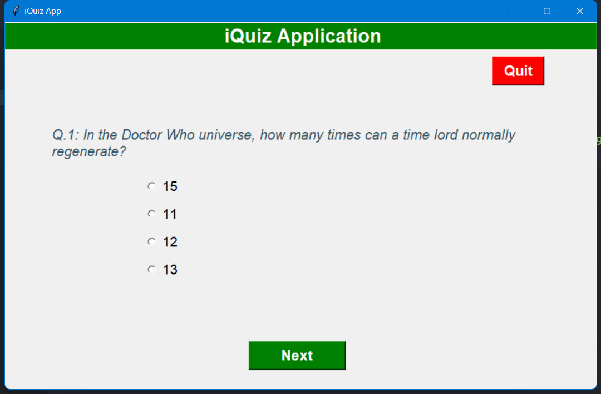
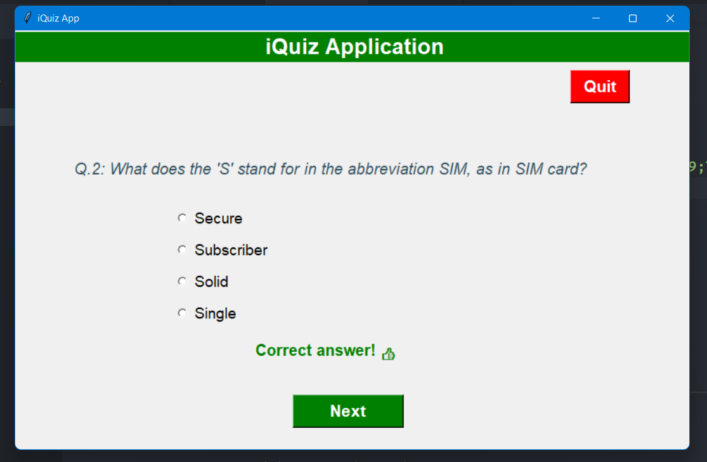
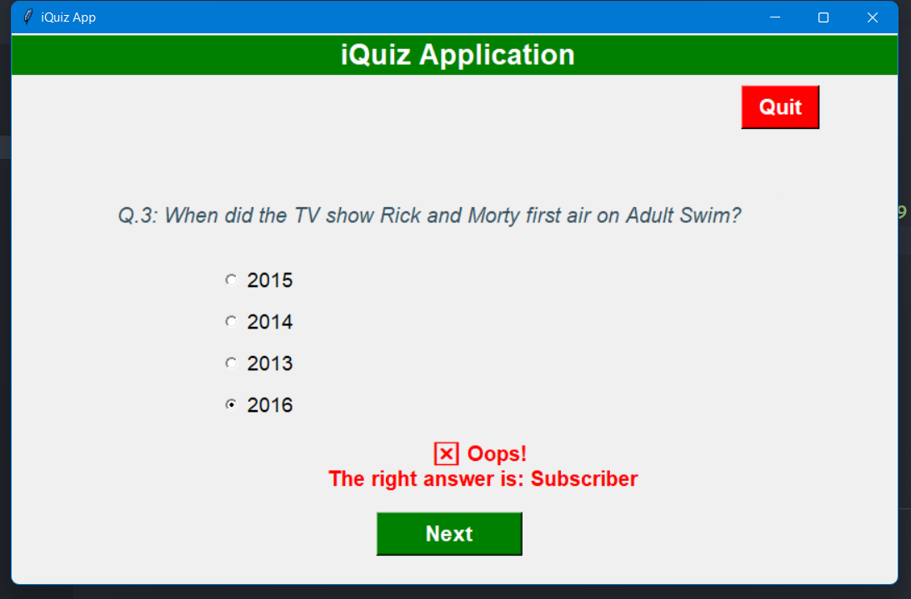
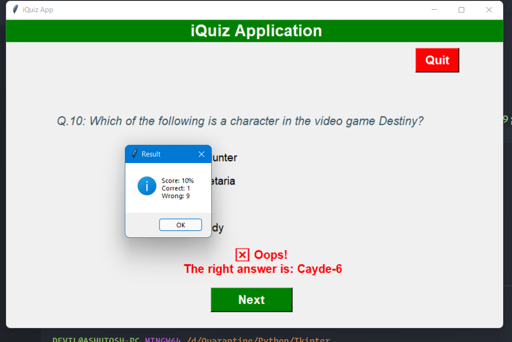

# GUI Quiz Application using Tkinter and Open Trivia DB

This is a Graphical User Interface (GUI) Quiz Application using the Tkinter Python built-in module. The task is to ask multiple-choice questions, collect user answers and finally display the results. Before coding the GUI, we'll first fetch multiple-choice questions, their correct answers, and the choices from the Open Trivia DB API. The Open Trivia Database provides a completely free JSON API for use in programming projects. Use of this API does not require an API Key. To make the task more interesting, we'll also randomize the order of choices. 

### Screenshots

 

 

 
